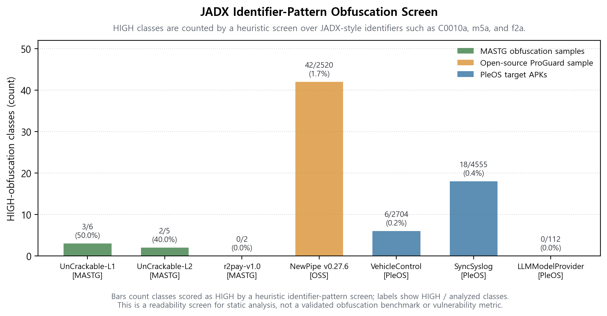
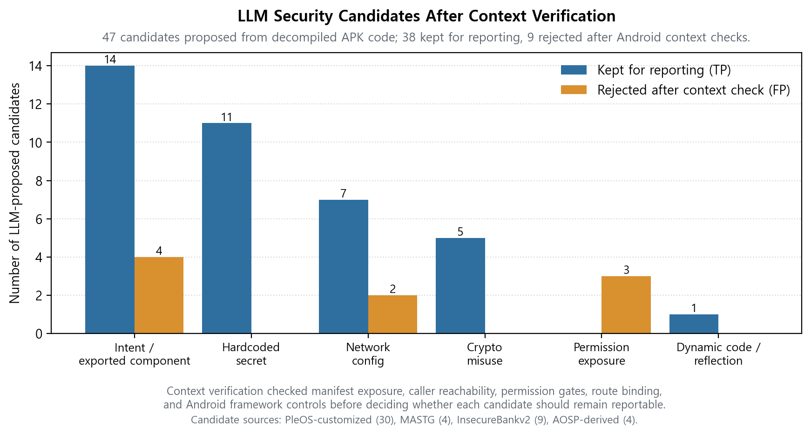
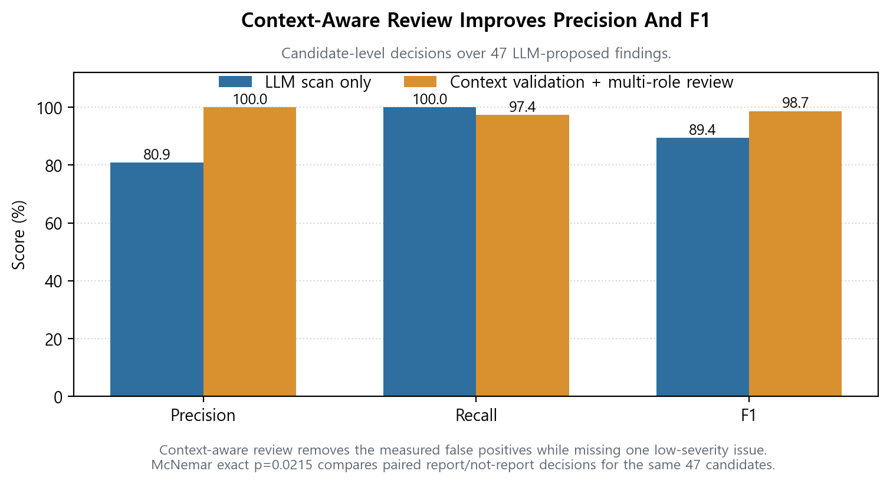
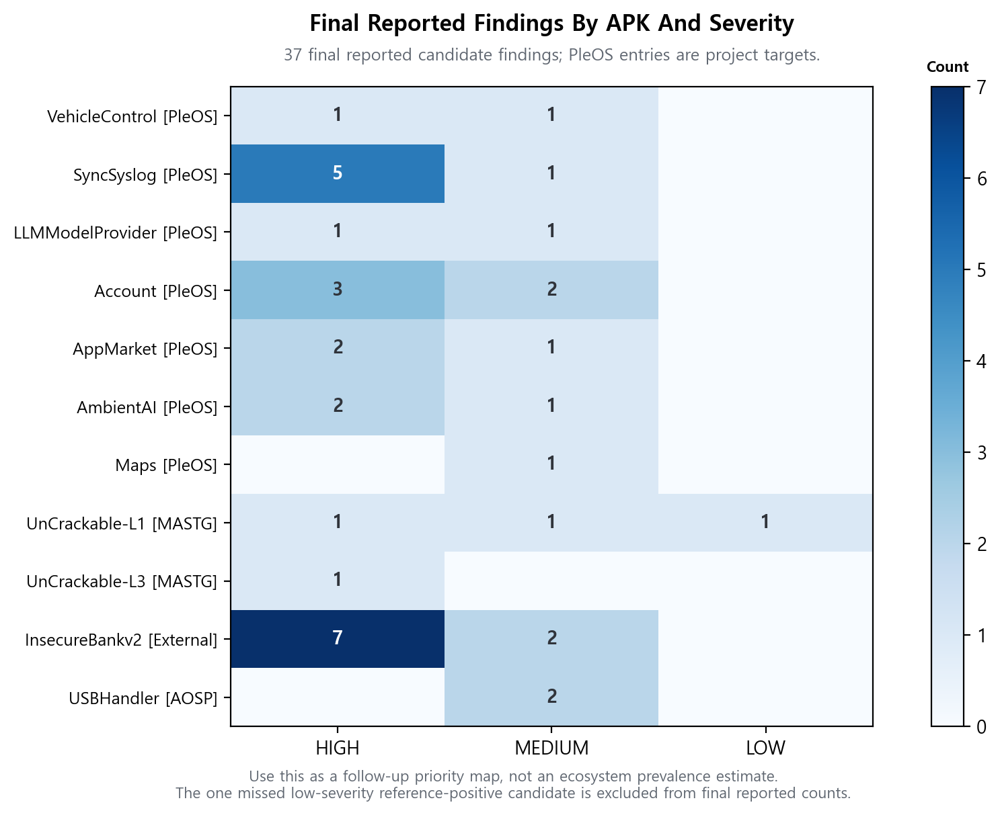
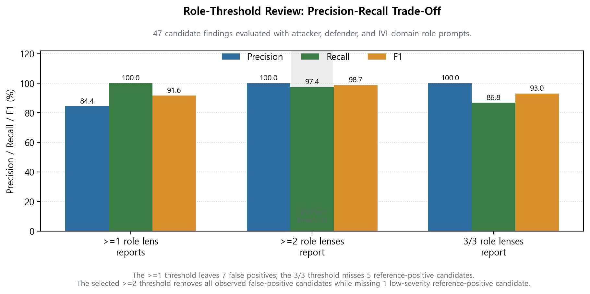
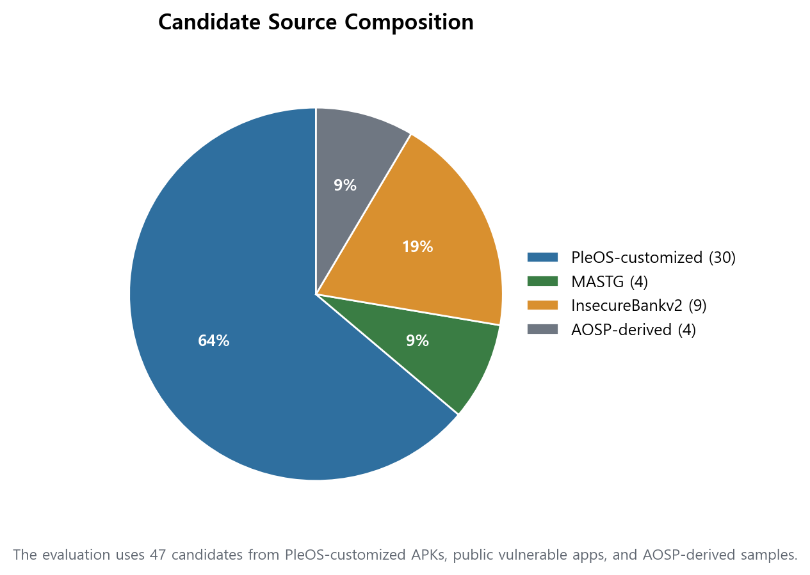
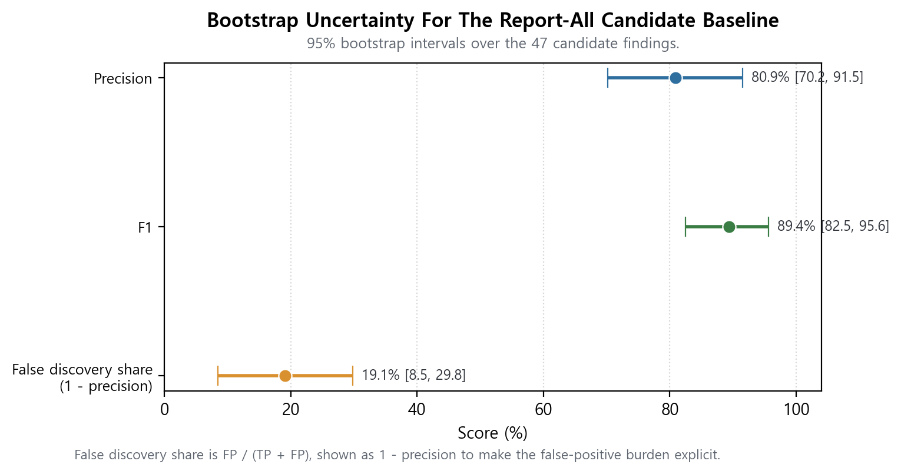
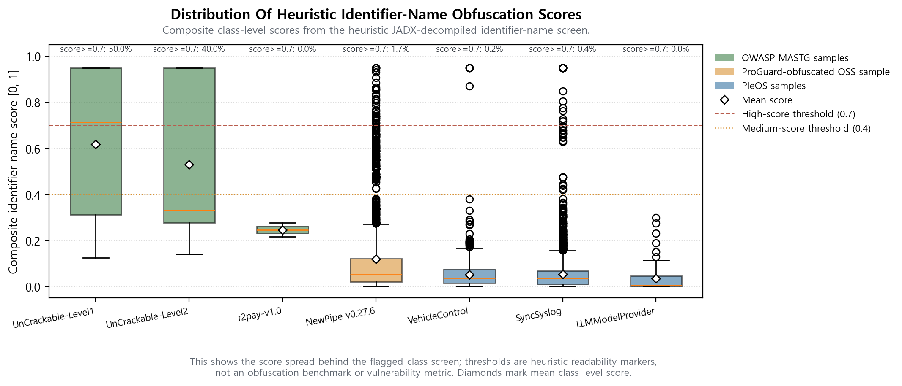
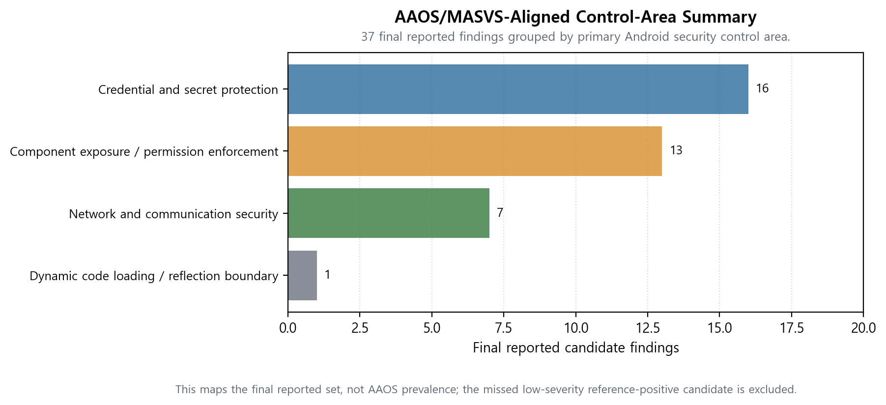
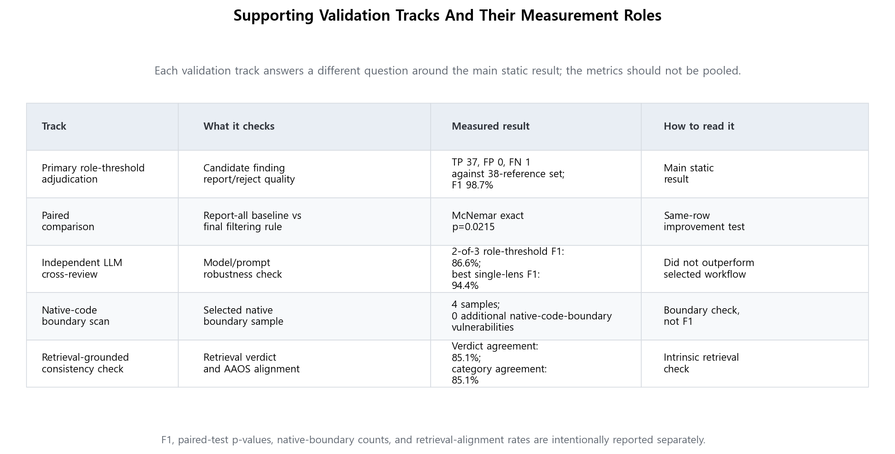

# LLM-Assisted Static Security Analysis for PleOS / AAOS IVI APKs

## 1. Executive Claim

This project built and evaluated an LLM-assisted static security-analysis pipeline for PleOS / Android Automotive OS IVI APKs.

The central result is not that an LLM alone works as a security scanner. The useful design is to use the LLM as a reasoning layer between deterministic APK triage and Android-domain contextual verification.

On the final 47-candidate evaluation set:

| Evaluation View | Precision | Recall | F1 | Interpretation |
|---|---:|---:|---:|---|
| LLM candidate scan | 80.9% | 100.0% | 0.894 | Useful for collecting suspicious candidate findings, but false positives remain. |
| Final `>=2`-role reporting rule | 100.0% | 97.4% | 0.987 | Reports 37 findings against the 38-reference-positive set, with 0 false positives and 1 low-severity false negative. |

The paired improvement from LLM candidate scan to the final reporting rule is visible on this corpus with McNemar exact test `p=0.0215`.

## 2. Problem, Threat Model, And Scope

PleOS / AAOS IVI APKs combine ordinary Android application surfaces with vehicle-adjacent permissions, exported components, local content providers, Binder services, route state, system integrations, and OEM trust boundaries.

A keyword scan or one-pass LLM review can find suspicious code, but Android exploitability depends on details outside the suspicious line itself:

- whether the component is exported,
- whether a normal same-device app can reach the entrypoint,
- whether a permission or signature gate blocks the caller,
- whether route binding keeps data internal,
- whether Android framework controls prevent spoofing or mutation,
- whether the evidence supports a vehicle/IVI security claim under the stated threat model.

The evaluated workflow is therefore claim-first: deterministic triage and LLM reasoning generate reviewable security hypotheses, and Android context validation checks whether each hypothesis survives reachability and framework constraints. This work does not claim that LLM reasoning replaces a full rule-based Android analyzer, nor that the LLM-first order is faster than a complete APK-wide rule-only discovery system.

The final claims use this conservative threat model:

| Item | In Scope | Boundary |
|---|---|---|
| Attacker | Same-device unprivileged Android app or app-level caller. | No root, system UID, privileged permission, OEM signing key, or undisclosed credential is assumed unless a case explicitly states it. |
| Target surfaces | Exported components, providers, receivers, services, WebView paths, credentials, logs, network configuration, and IVI-local data flows. | Not an exhaustive proof of every Android call path or every app in the ecosystem. |
| Evidence level | Static APK evidence from JADX output, manifests, configs, and selected same-device emulator validation. | Runtime traces refine claim strength; they do not change the static `n=47` precision/recall table. |
| Network interpretation | Cleartext transport, missing TLS validation, and sensitive network-client configuration. | No remote code execution or remote vehicle control is claimed from static evidence alone. |
| Non-goals | Public-safe reporting, AAOS/MASVS/TARA mapping, and bounded emulator PoC evidence. | No real-vehicle actuation, steering, braking, gear, powertrain, autonomous-driving takeover, or universal benchmark guarantee. |

This report covers static APK analysis and selected same-device emulator validation. It does not claim remote exploitation, real-vehicle actuation, steering/braking/gear takeover, autonomous-driving takeover, or a universal benchmark result.

## 3. Method Overview

The final pipeline is role-based:

```text
PleOS / AAOS APKs
  -> JADX decompilation
  -> static preprocessing
       -> JADX-decompiled identifier-name obfuscation pre-screen
       -> keyword and security-pattern triage
  -> LLM candidate scan
  -> Android context validation
       -> manifest exposure
       -> caller reachability
       -> permission gate
       -> route binding
       -> protected broadcast / framework control
  -> multi-role LLM review
       -> attacker
       -> defender
       -> in-vehicle infotainment (IVI)-domain reviewer
  -> findings reported by the final >=2-role rule
  -> evaluation, mapping, reports, and supporting validation
```

The important separation is between **finding candidates**, **forming security claims**, and **verifying whether those claims hold**.

Deterministic triage does not decide vulnerabilities. It narrows the decompiled APK to security-relevant areas: exported components, providers, broadcasts, WebView use, permission APIs, cleartext networking, hardcoded credentials, cryptographic APIs, dynamic loading, and IVI-specific service surfaces.

The LLM candidate scan then turns those prioritized code locations into candidate claims. A candidate claim is a concrete statement such as "this exported provider may expose sensitive rows", "this permission-management call may be reachable from an untrusted caller", or "this WebView path may cross a trust boundary." This step is intentionally broad because its role is to create reviewable security hypotheses, not to produce the final report.

Android/PleOS context validation tests each candidate claim against platform evidence. It checks whether the component is exported, whether a normal same-device caller can reach it, whether signature or privileged permissions block it, whether the broadcast is protected, whether route or caller binding keeps the value internal, whether explicit package/component binding prevents external control, and whether the sensitive value actually crosses a process, component, or trust boundary.

Each candidate is carried forward as an evidence package:

| Evidence Package Field | Purpose |
|---|---|
| Candidate claim | States the suspected security issue in reviewable form. |
| Static evidence | Names the APK, component, entrypoint, sink/source behavior, category, severity, and public-safe evidence breadcrumb. |
| Android context evidence | Records manifest exposure, caller reachability, permission gates, route binding, protected-broadcast semantics, and framework controls. |
| Blocking controls | Explains why a suspicious code pattern does not survive as a reportable finding when Android context blocks it. |
| Role-review decision | Records whether attacker, defender, and IVI-domain reviewer prompts support final reporting. |
| Claim boundary | Separates static reportability from runtime reachability, data effect, UI effect, or unsupported vehicle-control claims. |

This is why the rule/context layer is applied after candidate generation. The verification rules answer claim-shaped questions: "does this suspected provider exposure hold?", "does this suspected permission abuse path have an external caller?", "does this suspected broadcast issue survive Android protected-broadcast semantics?" Without a candidate claim, the same rules become a much broader discovery analyzer over every component, route, API, and value-flow surface. That broader rule-only discovery system is a different baseline, not the method evaluated here.

The three-role review is the final reporting gate after the evidence package exists. Each of the 47 candidates is reviewed by role-prompted attacker, defender, and IVI-domain reviewers, and the final report includes a candidate only when enough reviewers support reporting it.

| Role-Prompted Reviewer | Main Question | Typical Reject Reason |
|---|---|---|
| Attacker | Can an untrusted same-device caller plausibly abuse this under the stated threat model? | No reachable caller, protected broadcast, or framework permission gate. |
| Defender | Is the evidence strong enough to report and fix? | Only a hardening concern, weak evidence package, or no demonstrated boundary crossing. |
| IVI-domain reviewer | Does the candidate matter under PleOS / AAOS IVI trust boundaries? | Unsupported escalation into vehicle-control or real-vehicle claims. |

The roles are separated because a single LLM review can overfit to one question. The point is not to simulate three independent people or three model vendors; it is to force the same evidence package through three different security questions before final reporting.

The report uses these terms consistently:

| Term | Meaning |
|---|---|
| LLM-proposed candidate findings | The 47 reviewable security claims produced by candidate generation. |
| Reference-positive vulnerability findings | The 38 candidates labelled reportable under the project threat model. |
| Final reported findings | The 37 candidates reported by the selected `>=2`-role rule. |
| Rejected false positives | The 9 LLM-proposed candidates rejected after context validation and review. |
| False negative against reference set | The 1 low-severity reference-positive candidate not reported by the final rule. |

Figure 1 is the static-analysis readability screen. It is not a vulnerability metric and not a validated obfuscation benchmark.



Figure 2 shows the final candidate outcomes: the LLM proposes candidate findings, Android context validation rejects false positives, and the selected multi-role threshold leaves one low-severity true vulnerability unconfirmed.



Figure 3 shows why context-aware review matters.



Figure 4 shows final reported findings by APK and severity. It is a follow-up priority map, not a prevalence claim about the full PleOS / AAOS ecosystem.



## 4. Candidate Set And Labeling Protocol

The final evaluation unit is one LLM-proposed finding record: one candidate row in the evaluation data. In report figures and prose, this unit is described as a candidate finding, not an APK, class, line, or raw keyword hit.

A candidate finding represents one stable security-relevant claim identified by APK, entrypoint or class, sink/source behavior, category, and security consequence.

Candidate findings are merged when they refer to the same APK, same reachable entrypoint, same sink/source behavior, and same security consequence. For example, nearby helper calls are grouped when they support one exploitability argument, and repeated constants are grouped when they belong to the same credential exposure.

Candidate findings are split when the same APK contains independently reachable entrypoints, when two sink/source behaviors create different security consequences, or when one candidate is blocked by a permission gate while another is blocked by route binding. This keeps `n=47` tied to reportable candidate units rather than raw grep hits or APK counts.

The final set contains 47 candidates:

| Source | Candidates | Reference Positives | Reference Negatives | Role |
|---|---:|---:|---:|---|
| PleOS-customized APKs | 30 | 23 | 7 | Main IVI target findings. |
| OWASP MASTG samples | 4 | 4 | 0 | External Android vulnerability controls. |
| InsecureBankv2 | 9 | 9 | 0 | External vulnerable-corpus controls. |
| AOSP-derived samples | 4 | 2 | 2 | Framework-blocking and false-positive controls. |
| Total | 47 | 38 | 9 | Final measured evaluation set. |

Reference labels are reportability labels under this project threat model. `is_real=true` means the evidence package supports reporting the finding statically under the stated boundary. It does not imply runtime exploitation unless a separate runtime claim level is attached.

The label construction protocol was:

| Step | Rule |
|---|---|
| Candidate evidence package | Collect the candidate claim, source location, category, static evidence, and Android context evidence. |
| Android context validation | Check manifest exposure, caller reachability, permission gates, route binding, protected-broadcast semantics, and framework controls. |
| Reference label | Assign `reference-positive` when the evidence package supports reporting under the threat model; assign `reference-negative` when Android context blocks the claim or no security-relevant boundary remains. |
| Known vulnerable corpora | Inherit positive labels only when the candidate maps to the known vulnerable behavior in MASTG or InsecureBankv2. |
| PleOS project labels | Use decompiled code, manifest context, contextual verification notes, and redacted public reports. These labels are project labels and should receive independent reviewer validation in future work. |
| AOSP-derived controls | Use framework-blocking examples as negative/control evidence, not as claims about all AOSP components. |

The answer key is mixed by origin. External corpora reduce label-bias risk, but PleOS and AOSP-derived findings are not independent public vulnerability oracles.

## 5. Main Results

| Evaluation View | Reported | TP | FP | FN | Precision | Recall | F1 |
|---|---:|---:|---:|---:|---:|---:|---:|
| LLM candidate scan | 47 | 38 | 9 | 0 | 80.9% | 100.0% | 0.894 |
| `>=1` role reports | 45 | 38 | 7 | 0 | 84.4% | 100.0% | 0.916 |
| Final `>=2`-role reporting rule | 37 | 37 | 0 | 1 | 100.0% | 97.4% | 0.987 |
| `3/3` roles report | 33 | 33 | 0 | 5 | 100.0% | 86.8% | 0.930 |

The final reporting threshold is two or more role-prompted reviewers. It kept precision at 100.0% on this labelled set while retaining 97.4% recall.

Because the evaluation set contains 47 candidate findings, all metrics are corpus-bound. The 100.0% precision result means zero observed false positives on this labelled set; it is not a universal false-positive guarantee.

The pipeline accountability is:

| Layer | What It Decides | Measurement Role |
|---|---|---|
| Deterministic triage | Which decompiled code areas deserve security review. | Narrows the search space; not a TP/FP classifier. |
| LLM candidate scan | Which reviewable security claims should enter the candidate set. | Recall-oriented baseline: TP 38 / FP 9 / FN 0. |
| Android context validation | Whether each candidate claim survives manifest, caller, permission, route, and framework checks. | Evidence-packaging and context-filtering layer; not reported here as a standalone automated classifier. |
| Final `>=2`-role review | Whether the evidence package is strong enough to report. | Final rule: TP 37 / FP 0 / FN 1. |



Figure 5 compares three consensus thresholds for the 47 candidate findings. The role-prompted reviewers intentionally ask different questions: can it be abused, is the evidence strong enough to report, and does it matter in the IVI context. If one reviewer agreement is enough, recall stays at 100.0% but seven false positives remain. If all three reviewers must agree, precision stays high but recall drops to 86.8%. The selected threshold is two or more agreeing reviewers: it reports 37 findings with zero false positives and one missed low-severity issue.

The one missed item is `vc-7`, a low-severity API 34 receiver-hardening item. It remains counted as a false negative rather than being manually corrected after the fact.

The paired comparison is:

|  | Final reporting decision correct | Final reporting decision incorrect |
|---|---:|---:|
| LLM candidate scan correct | 37 | 1 |
| LLM candidate scan incorrect | 9 | 0 |

McNemar exact two-tailed test gives `p=0.0215`.

## 6. Why Context Validation Removed False Positives

The nine false positives from the LLM candidate scan were not random mistakes. They came from patterns that look security-relevant in code but depend on Android reachability and trust boundaries.

Context validation and multi-role review have different jobs. Context validation asks whether the candidate claim survives Android platform evidence: exported state, caller reachability, permissions, routes, protected broadcasts, and framework controls. Multi-role review asks whether the evidence package should be included in the final report.

| FP ID | Candidate Trigger | Blocking Evidence | Final Interpretation |
|---|---|---|---|
| `vc-1` | WebView file/network pattern | No exploitable external producer established. | Hardening concern only. |
| `vc-2` | WebView load URL pattern | Same caller-chain boundary as `vc-1`. | No reportable trust-boundary crossing. |
| `vc-3` | `grantRuntimePermission` API | Navigation/route binding kept package name internal. | Not externally reachable. |
| `vc-4` | `revokeRuntimePermission` API | Symmetric route/caller block. | Not externally reachable. |
| `usb-2` | USB permission grant path | Framework filters and `MANAGE_USB` checks block caller control. | No normal-app bypass found. |
| `ss-1` | Exported boot receiver | `BOOT_COMPLETED` is a protected broadcast. | Normal app cannot trigger path. |
| `am-4` | Custom install/uninstall action | Action reached UI navigation only; user confirmation preserved. | No auto-install primitive. |
| `amb-4` | Cross-package broadcast | Explicit component targets PleOS-internal receiver. | Not an implicit broadcast leak. |
| `amb-5` | Exported voice service action | Signature-level voice interaction permission gates binding. | Framework permission mitigates path. |

Two short cases show the difference between a surviving claim and a rejected candidate:

| Mini-Case | Evidence Chain | Outcome |
|---|---|---|
| `lmp-1` prompt provider | Manifest/provider evidence identifies an exported prompt-provider surface; the candidate remains relevant under a same-device IVI attacker model; runtime provider querying can strengthen the claim level when local response evidence is attached. | Reference-positive and reported by the final rule; no remote exploit or public prompt dump is claimed. |
| `ss-1` boot receiver | Stage 1 sees an exported receiver, but Android protects `BOOT_COMPLETED`; a normal app cannot emit the trigger broadcast. | Reference-negative and rejected as a false positive. |

The main lesson is that broad LLM detection is useful for recall, but reporting requires Android context evidence.

## 7. Reference Findings And Case Priorities

The reference set contains 38 reference-positive vulnerability findings. The selected multi-role reporting threshold reports 37 of them and misses one low-severity hardening item.

High-severity final reported findings are concentrated in credential/logging/network/component surfaces rather than evenly distributed across the repo. Figure 4 shows the reported-positive distribution by APK and severity, so it should be read as a priority map for case study and PoC selection.

Representative cases:

| Finding | APK | Final Role | Claim Boundary |
|---|---|---|---|
| `amb-1` | `ai.umos.ambientai` | Reference-positive; reported | Production LLM API-key exposure pattern; public docs keep literal secret redacted. |
| `am-3` | `ai.umos.appmarket` | Reference-positive; reported | OAuth client-secret pattern in account flow; public docs keep secret value redacted. |
| `acc-4` | `ai.pleos.playground.account` | Reference-positive; reported | SSO secret crosses an Activity boundary. |
| `ssl-6` | `ai.pleos.sync.syslog` | Reference-positive; reported | gRPC plaintext transport in diagnostic/system-log context. |
| `lmp-1` | `ai.pleos.llm.model.provider` | Reference-positive; reported | Prompt-provider exposure; runtime strength depends on captured provider response. |
| `vc-6` | `ai.umos.vehiclecontrol` | Reference-positive; reported | Static IVI finding under the stated threat model; no remote exploitation or real-vehicle control claim. |
| `vc-3/4` | `ai.umos.vehiclecontrol` | Reference-negative; rejected | Caller route blocked by manifest/navigation/internal binding. |
| `usb-2` | `android.car.usb.handler` | Reference-negative; rejected | Framework permission checks block caller control. |
| `ss-1` | `com.android.statementservice` | Reference-negative; rejected | Protected broadcast blocks normal-app trigger. |

Detailed evidence lives in `docs/03_case_studies.md`.

## 8. Automotive Mapping

The project does not stop at APK findings. Reference-positive findings and final reported findings are mapped into automotive-security reporting artifacts:

- AAOS security areas,
- OWASP MASVS categories,
- TARA-oriented assets, threats, risk levels, and treatment language.

The mapping is a translation layer from static finding evidence to automotive-security communication. It is not a real-vehicle risk proof by itself.

Mapping artifacts:

- `src/mapping/aaos_map.py`
- `src/mapping/tara_generate.py`
- `data/reports/aggregate/aaos_mapping_table.md`
- `data/reports/aggregate/tara_artifact.md`

## 9. Supporting Validation Tracks

Supporting tracks clarify robustness, blind spots, and boundaries. They do not replace the main 47-candidate static evaluation.

| Track | Result | Interpretation |
|---|---|---|
| Bootstrap CI | Candidate-scan precision 95% CI `[70.2%, 91.5%]` | Corpus-bound uncertainty estimate, not a universal scanner guarantee. |
| Retrieval-grounded consistency check | nearest-neighbor verdict 85.1%, AAOS category alignment 85.1% | Retrieval quality measured; end-to-end prompted LLM gain remains separate work. |
| Native-code boundary scan | 4 `.so` samples, 0 additional native-code-boundary vulnerabilities | Static sample-level boundary check; dynamic JNI/Go/runtime flow remains limited. |
| Independent LLM cross-review | precision 100.0%, recall 76.3%, F1 0.866 | Did not beat the calibrated multi-role baseline; evidence packaging mattered more than model count. |

Appendix Figure A5 gives the visual summary for these supporting tracks while keeping their different metric meanings separate.

## 10. Runtime PoC Evidence Boundary

The runtime PoC track is a validation layer for selected high-value findings. It is not the source of the main precision/recall table.

Runtime work includes:

- a safe same-device harness APK track,
- ADB-driven emulator probes,
- Frida hooks for selected providers, receivers, Binder calls, logs, token paths, KDF passphrase paths, and native command candidates,
- a static-to-dynamic state machine for claim-level tracking.

Claim-level examples:

| Surface | Runtime Evidence Role | Boundary |
|---|---|---|
| NaviService route request | Same-device route UI influence under emulator conditions. | Not autonomous-driving takeover or automatic guidance start. |
| VehicleService property mutation | Reversible `MIRROR_FOLD` property mutation under emulator conditions. | No steering, braking, gear, powertrain, or real-vehicle actuation claim. |
| Prompt provider | Same-device provider query path can be exercised. | Data strength depends on redacted captured rows. |
| Vehicle broadcast receiver | Benign explicit broadcast delivery can be observed. | State pollution requires captured state/log difference. |
| AppMarket suggestions provider | Harness scripts support harmless marker write/read checks. | Install hijack requires user-visible UI evidence and is not claimed from static evidence alone. |

Raw APKs, harness outputs, logs, screenshots, videos, prompt rows, and unredacted proprietary evidence stay local-only under `data/_local/` or `data/reports/*_local/`.

## 11. Limitations

| Limit | Current State | Remaining Boundary |
|---|---|---|
| Label bias | External corpora were added. | PleOS-customized labels still need independent reviewer validation. |
| Corpus selection | Security-value selected corpus. | Not an app-store random benchmark. |
| Small evaluation set | Final measured set contains 47 candidate findings. | Metrics are corpus-bound and should not be read as universal scanner performance. |
| Rule-only discovery baseline | Not implemented as a full APK-wide analyzer. | Future work should compare this claim-first workflow against a full rule-only discovery system. |
| Obfuscation screen | Heuristic JADX identifier-pattern screen. | Not a validated obfuscation benchmark. |
| Context validation | Effective on this corpus. | Not a complete Android reachability engine. |
| Native/runtime behavior | Native static sample and runtime scaffolding exist. | Dynamic JNI, Go runtime, and syscall argument flow remain only partially observed. |
| Retrieval effect | Intrinsic retrieval quality measured. | End-to-end prompted LLM improvement is not measured. |
| Runtime PoC | Same-device emulator evidence and harnesses exist. | Does not imply remote exploitation or real-vehicle control. |
| Public disclosure | Redacted public artifacts exist. | Raw APKs, JADX output, logs, videos, and unredacted evidence remain local-only. |

## 12. Contributions

1. A role-based LLM-assisted static APK security-analysis pipeline for PleOS / AAOS IVI targets.
2. A 47-candidate evaluation set with explicit finding-unit rules and source boundaries.
3. Measured evidence that Android context validation and multi-role review reduce false positives compared with a broad LLM candidate scan.
4. AAOS / MASVS / TARA mapping artifacts that translate code-level findings into automotive-security language.
5. A public/private artifact boundary that supports redacted reporting without publishing proprietary PleOS evidence.
6. Supporting validation tracks covering statistics, retrieval-grounded consistency, native-code boundary analysis, runtime PoC validation, and independent LLM cross-review.

## 13. Appendix Figure Set

The appendix figures are part of the final report. They keep supporting evidence visible without interrupting the main narrative sequence.

Appendix Figure A1 explains where the 47 evaluation candidate findings came from. Each unit is one candidate finding, not one APK or an ecosystem prevalence estimate: PleOS-customized findings form the main in-vehicle infotainment (IVI) target set, while MASTG, InsecureBankv2, and AOSP-derived findings serve as controls.



Appendix Figure A2 shows bootstrap uncertainty for the LLM-only candidate scan. It keeps precision, F1, and false discovery share as measured LLM-only quantities. The false discovery share is `FP / (TP + FP)`, equivalent to `1 - precision`, so it makes the false-positive burden visible without using the standard false-positive-rate definition that would require true negatives.



Appendix Figure A3 shows the distribution of heuristic identifier-name obfuscation scores. Figure 1 uses flagged-class counts for readability; this appendix view preserves the score spread, high-score and medium-score threshold markers, and mean-score diamonds so the screen can be inspected in more detail.



Appendix Figure A4 groups the 38 reference-positive findings into AAOS/MASVS-aligned Android security control areas. It supports the automotive mapping section by showing how manually verified code-level findings are translated into security-reporting categories; the primary `>=2` role-prompted review reports 37 of these 38.



Appendix Figure A5 summarizes supporting validation tracks without forcing them onto one shared score. It reinforces the report boundary: paired comparison, retrieval-grounded consistency, native-code boundary scanning, and independent LLM cross-review use different measurement meanings and do not replace the main static result.



## 14. Artifact Index

| Purpose | Path |
|---|---|
| Archive summary | `docs/01_final_summary.md` |
| One-page brief | `docs/02_final_brief.md` |
| Case studies | `docs/03_case_studies.md` |
| Context verification method | `docs/04_methodology_stage2.md` |
| Chart inventory | `docs/05_charts.md` |
| Limitations and cost | `docs/06_limitations_and_costs.md` |
| Remaining work | `docs/07_remaining_work.md` |
| Completed reinforcement tracks | `docs/08_completed_reinforcements.md` |
| Project inventory | `docs/10_project_inventory.md` |
| Figure plan | `docs/11_figure_redesign_plan.md` |
| Runtime PoC details | `docs/12_runtime_poc_details.md` |
| Ground-truth labels | `data/ground_truth/combined_labels.json` |
| Aggregate metrics | `data/reports/aggregate/` |
| Public masked reports | `data/reports/public/` |
| Local-only evidence boundary | `data/_local/`, `data/reports/*_local/` |
