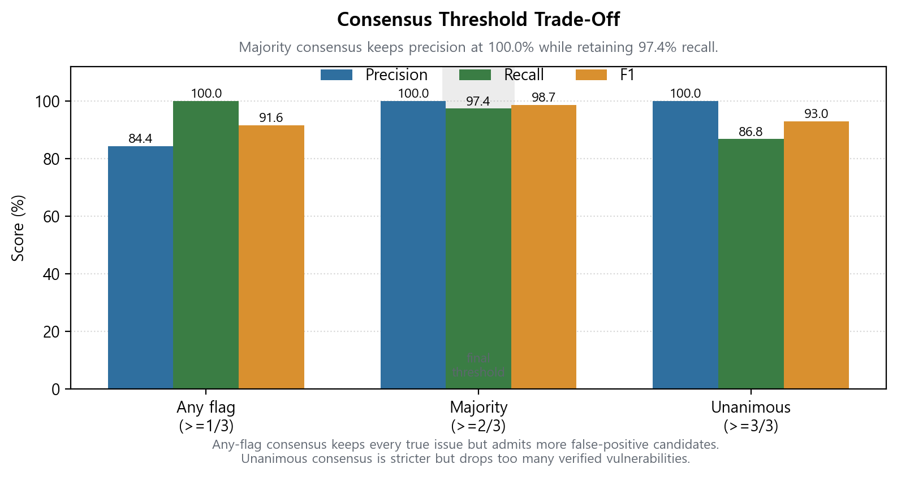
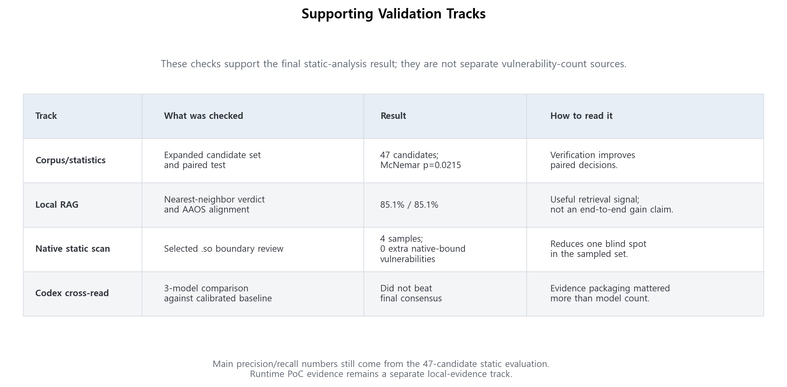

# LLM-Assisted Static Security Analysis for PleOS / AAOS IVI APKs

## 1. Executive Claim

This project built and evaluated an LLM-assisted static security-analysis pipeline for PleOS / Android Automotive OS IVI APKs.

The central result is not that an LLM alone works as a security scanner. The useful design is to use the LLM as a reasoning layer between deterministic APK triage and Android-domain contextual verification.

On the final 47-candidate evaluation set:

| Evaluation View | Precision | Recall | F1 | Interpretation |
|---|---:|---:|---:|---|
| LLM candidate scan | 80.9% | 100.0% | 0.894 | Useful for collecting suspicious candidates, but false positives remain. |
| Verified reporting | 100.0% | 97.4% | 0.987 | Context and consensus verification removed measured false positives while missing one low-severity hardening item. |

The paired LLM-scan to verified-reporting improvement is visible on this corpus with McNemar exact test `p=0.0215`.

## 2. Problem And Scope

PleOS / AAOS IVI APKs combine ordinary Android application surfaces with vehicle-adjacent permissions, exported components, local content providers, Binder services, route state, system integrations, and OEM trust boundaries.

A keyword scan or one-pass LLM review can find suspicious code, but Android exploitability depends on details outside the suspicious line itself:

- whether the component is exported,
- whether a normal same-device app can reach the entrypoint,
- whether a permission or signature gate blocks the caller,
- whether route binding keeps data internal,
- whether Android framework controls prevent spoofing or mutation,
- whether the evidence supports a vehicle/IVI security claim under the stated threat model.

This report covers static APK analysis and selected same-device emulator validation. It does not claim remote exploitation, real-vehicle actuation, steering/braking/gear takeover, autonomous-driving takeover, or a universal benchmark result.

## 3. Research Pipeline

The final pipeline is role-based:

```text
PleOS / AAOS APKs
  -> JADX decompilation
  -> static preprocessing
       -> JADX identifier-pattern obfuscation screen
       -> keyword and security-pattern triage
  -> LLM candidate scan
  -> Android context verification
       -> manifest exposure
       -> caller reachability
       -> permission gate
       -> route binding
       -> protected broadcast / framework control
  -> multi-perspective consensus
       -> attacker
       -> defender
       -> IVI domain expert
  -> verified vulnerabilities
  -> evaluation, mapping, reports, and supporting validation
```

Figure 1 is the static-analysis readability screen. It is not a vulnerability metric and not a validated obfuscation benchmark.


Figure 2 shows the main filtering step: the LLM proposes security candidates, then Android context verification determines which ones remain as verified vulnerabilities.


Figure 3 shows why the verification layer matters.


Figure 4 shows the verified vulnerability set by APK and severity. It is a follow-up priority map, not a prevalence claim about the full PleOS / AAOS ecosystem.


## 4. Evaluation Corpus

The final evaluation unit is a finding-level candidate row, not an APK, class, line, or raw keyword hit.

A row represents one stable security-relevant candidate identified by APK, entrypoint or class, sink/source pattern, category, and security consequence. Rows are split when the entrypoint, sink/source pattern, consequence, or contextual verification rule differs.

The final set contains 47 candidates:

| Source | Candidates | Role |
|---|---:|---|
| PleOS-customized APKs | 30 | Main IVI target rows. |
| OWASP MASTG samples | 4 | External Android vulnerability controls. |
| InsecureBankv2 | 9 | External vulnerable-corpus controls. |
| AOSP-derived samples | 4 | Framework-blocking and false-positive controls. |
| Total | 47 | Final measured evaluation set. |

Ground-truth labels are reportability labels under this project threat model. `is_real=true` means the evidence package supports reporting the finding statically under the stated boundary. It does not imply runtime exploitation unless a separate runtime claim level is attached.

PleOS-customized labels are self-labelled from decompiled code, manifest context, contextual verification notes, and redacted public reports. External corpora reduce, but do not eliminate, label-bias risk.

## 5. Main Results

| Evaluation View | Accepted | TP | FP | FN | Precision | Recall | F1 |
|---|---:|---:|---:|---:|---:|---:|---:|
| LLM candidate scan | 47 | 38 | 9 | 0 | 80.9% | 100.0% | 0.894 |
| Any consensus flag | 45 | 38 | 7 | 0 | 84.4% | 100.0% | 0.916 |
| Majority consensus | 37 | 37 | 0 | 1 | 100.0% | 97.4% | 0.987 |
| Unanimous consensus | 33 | 33 | 0 | 5 | 100.0% | 86.8% | 0.930 |

The final reporting threshold is majority consensus (`>=2/3`). It kept precision at 100.0% on this labelled set while retaining 97.4% recall.



The one missed item is `vc-7`, a low-severity API 34 receiver-hardening item. It remains counted as a false negative rather than being manually corrected after the fact.

The paired comparison is:

|  | Verified reporting correct | Verified reporting incorrect |
|---|---:|---:|
| LLM candidate scan correct | 37 | 1 |
| LLM candidate scan incorrect | 9 | 0 |

McNemar exact two-tailed test gives `p=0.0215`.

## 6. Why Verification Removed False Positives

The nine false positives from the LLM candidate scan were not random mistakes. They came from patterns that look security-relevant in code but depend on Android reachability and trust boundaries.

| FP ID | Candidate Trigger | Blocking Evidence | Final Interpretation |
|---|---|---|---|
| `vc-1` | WebView file/network pattern | No exploitable external producer established. | Hardening concern only. |
| `vc-2` | WebView load URL pattern | Same caller-chain boundary as `vc-1`. | No reportable trust-boundary crossing. |
| `vc-3` | `grantRuntimePermission` API | Navigation/route binding kept package name internal. | Not externally reachable. |
| `vc-4` | `revokeRuntimePermission` API | Symmetric route/caller block. | Not externally reachable. |
| `usb-2` | USB permission grant path | Framework filters and `MANAGE_USB` checks block caller control. | No normal-app bypass found. |
| `ss-1` | Exported boot receiver | `BOOT_COMPLETED` is a protected broadcast. | Normal app cannot trigger path. |
| `am-4` | Custom install/uninstall action | Action reached UI navigation only; user confirmation preserved. | No auto-install primitive. |
| `amb-4` | Cross-package broadcast | Explicit component targets PleOS-internal receiver. | Not an implicit broadcast leak. |
| `amb-5` | Exported voice service action | Signature-level voice interaction permission gates binding. | Framework permission mitigates path. |

The main lesson is that broad LLM detection is useful for recall, but reporting requires Android context evidence.

## 7. Verified Findings And Case Priorities

The labelled corpus contains 38 verified security-positive rows. The majority-consensus reporting gate accepts 37 of them and misses one low-severity hardening item.

High-severity verified findings are concentrated in credential/logging/network/component surfaces rather than evenly distributed across the repo. Figure 4 shows the verified-positive distribution by APK and severity, so it should be read as a priority map for case study and PoC selection.

Representative cases:

| Finding | APK | Final Verdict | Claim Boundary |
|---|---|---|---|
| `amb-1` | `ai.umos.ambientai` | TP | Production LLM API-key exposure pattern; public docs keep literal secret redacted. |
| `am-3` | `ai.umos.appmarket` | TP | OAuth client-secret pattern in account flow; public docs keep secret value redacted. |
| `acc-4` | `ai.pleos.playground.account` | TP | SSO secret crosses an Activity boundary. |
| `ssl-6` | `ai.pleos.sync.syslog` | TP | gRPC plaintext transport in diagnostic/system-log context. |
| `lmp-1` | `ai.pleos.llm.model.provider` | TP | Prompt-provider exposure; runtime strength depends on captured provider response. |
| `vc-6` | `ai.umos.vehiclecontrol` | TP | Static TP under IVI threat model; no remote exploitation or real-vehicle control claim. |
| `vc-3/4` | `ai.umos.vehiclecontrol` | FP | Caller route blocked by manifest/navigation/internal binding. |
| `usb-2` | `android.car.usb.handler` | FP | Framework permission checks block caller control. |
| `ss-1` | `com.android.statementservice` | FP | Protected broadcast blocks normal-app trigger. |

Detailed evidence lives in `docs/03_case_studies.md`.

## 8. Automotive Mapping

The project does not stop at APK findings. Verified rows are mapped into automotive-security reporting artifacts:

- AAOS security areas,
- OWASP MASVS categories,
- TARA-oriented assets, threats, risk levels, and treatment language.

The mapping is a translation layer from static finding evidence to automotive-security communication. It is not a real-vehicle risk proof by itself.

Mapping artifacts:

- `src/mapping/aaos_map.py`
- `src/mapping/tara_generate.py`
- `data/reports/aggregate/aaos_mapping_table.md`
- `data/reports/aggregate/tara_artifact.md`

## 9. Supporting Validation Tracks

Supporting tracks clarify robustness, blind spots, and boundaries. They do not replace the main 47-candidate static evaluation.



| Track | Result | Interpretation |
|---|---|---|
| Bootstrap CI | Candidate-scan precision 95% CI `[70.2%, 91.5%]` | Corpus-bound uncertainty estimate, not a universal scanner guarantee. |
| RAG intrinsic retrieval | nearest-neighbor verdict 85.1%, AAOS category alignment 85.1% | Retrieval quality measured; end-to-end prompted LLM gain remains separate work. |
| Native static scan | 4 `.so` samples, 0 additional native-bound vulnerabilities | Static sample-level boundary check; dynamic JNI/Go/runtime flow remains limited. |
| Codex 3-model cross-read | precision 100.0%, recall 76.3%, F1 0.866 | Did not beat the calibrated majority-consensus baseline; evidence packaging mattered more than model count. |

Appendix figures in `data/viz/` provide corpus composition, bootstrap interval, obfuscation score distribution, mapping summary, and cross-validation comparison views.

## 10. Runtime PoC Evidence Boundary

The runtime PoC track is a validation layer for selected high-value findings. It is not the source of the main precision/recall table.

Runtime work includes:

- a safe same-device harness APK track,
- ADB-driven emulator probes,
- Frida hooks for selected providers, receivers, Binder calls, logs, token paths, KDF passphrase paths, and native command candidates,
- a static-to-dynamic state machine for claim-level tracking.

Claim-level examples:

| Surface | Runtime Evidence Role | Boundary |
|---|---|---|
| NaviService route request | Same-device route UI influence under emulator conditions. | Not autonomous-driving takeover or automatic guidance start. |
| VehicleService property mutation | Reversible `MIRROR_FOLD` property mutation under emulator conditions. | No steering, braking, gear, powertrain, or real-vehicle actuation claim. |
| Prompt provider | Same-device provider query path can be exercised. | Data strength depends on redacted captured rows. |
| Vehicle broadcast receiver | Benign explicit broadcast delivery can be observed. | State pollution requires captured state/log difference. |
| AppMarket suggestions provider | Harness scripts support harmless marker write/read checks. | Install hijack requires user-visible UI evidence and is not claimed from static evidence alone. |

Raw APKs, harness outputs, logs, screenshots, videos, prompt rows, and unredacted proprietary evidence stay local-only under `data/_local/` or `data/reports/*_local/`.

## 11. Limitations

| Limit | Current State | Remaining Boundary |
|---|---|---|
| Label bias | External corpora were added. | PleOS-customized labels still need independent reviewer validation. |
| Corpus selection | Security-value selected corpus. | Not an app-store random benchmark. |
| Obfuscation screen | Heuristic JADX identifier-pattern screen. | Not a validated obfuscation benchmark. |
| Context verification | Effective on this corpus. | Not a complete Android reachability engine. |
| Native/runtime behavior | Native static sample and runtime scaffolding exist. | Dynamic JNI, Go runtime, and syscall argument flow remain only partially observed. |
| RAG effect | Intrinsic retrieval quality measured. | End-to-end prompted LLM improvement is not measured. |
| Runtime PoC | Same-device emulator evidence and harnesses exist. | Does not imply remote exploitation or real-vehicle control. |
| Public disclosure | Redacted public artifacts exist. | Raw APKs, JADX output, logs, videos, and unredacted evidence remain local-only. |

## 12. Contributions

1. A role-based LLM-assisted static APK security-analysis pipeline for PleOS / AAOS IVI targets.
2. A 47-candidate evaluation set with explicit finding-unit rules and source boundaries.
3. Measured evidence that Android context and consensus verification reduce false positives compared with a broad LLM candidate scan.
4. AAOS / MASVS / TARA mapping artifacts that translate code-level findings into automotive-security language.
5. A public/private artifact boundary that supports redacted reporting without publishing proprietary PleOS evidence.
6. Completed reinforcement tracks covering statistics, RAG, native static analysis, runtime PoC validation, and Codex cross-read.

## 13. Artifact Index

| Purpose | Path |
|---|---|
| Archive summary | `docs/01_final_summary.md` |
| One-page brief | `docs/02_final_brief.md` |
| Case studies | `docs/03_case_studies.md` |
| Context verification method | `docs/04_methodology_stage2.md` |
| Chart inventory | `docs/05_charts.md` |
| Limitations and cost | `docs/06_limitations_and_costs.md` |
| Remaining work | `docs/07_remaining_work.md` |
| Completed reinforcement tracks | `docs/08_completed_reinforcements.md` |
| Project inventory | `docs/10_project_inventory.md` |
| Figure plan | `docs/11_figure_redesign_plan.md` |
| Runtime PoC details | `docs/12_runtime_poc_details.md` |
| Ground-truth labels | `data/ground_truth/combined_labels.json` |
| Aggregate metrics | `data/reports/aggregate/` |
| Public masked reports | `data/reports/public/` |
| Local-only evidence boundary | `data/_local/`, `data/reports/*_local/` |
