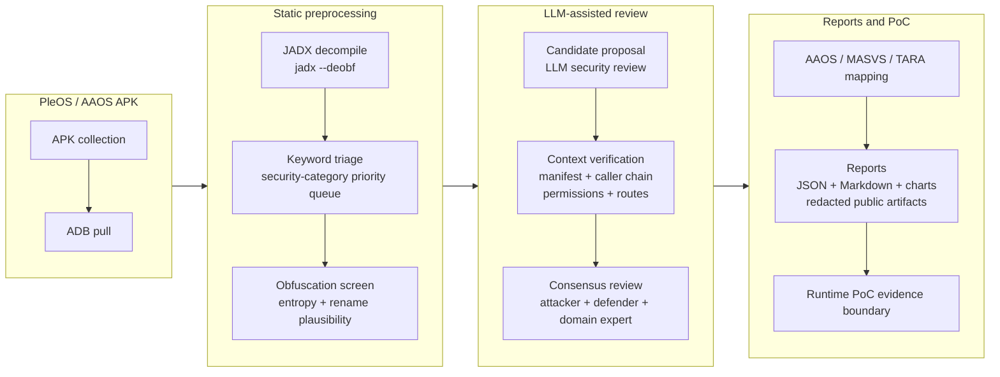
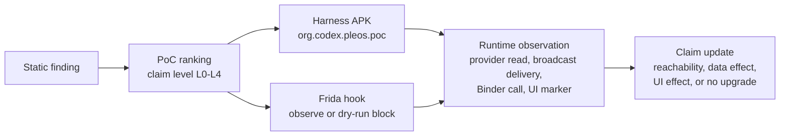

# pleos-llm-scanner

LLM-assisted static security analysis pipeline for Android Automotive / PleOS IVI APKs.

## Overview

`pleos-llm-scanner` is the final 15-week research archive for an LLM-assisted static security analysis pipeline targeting PleOS / AAOS IVI APKs. It turns decompiled Android code into security findings, verification evidence, automotive-security mappings, and public-safe reports.

The repository uses scripts for deterministic work such as APK extraction, JADX decompilation, keyword triage, evaluation, chart generation, and AAOS/TARA mapping. Interactive Codex / Claude Code sessions were used for the parts that need security reasoning: interpreting candidate findings, checking Android context, and comparing attacker / defender / domain-expert views.

This is not a turnkey automated LLM scanner. It is a research artifact that combines reproducible scripts, prompt protocols, session-derived review artifacts, and redacted reports.

## How To Read This Repository

Read the public files as a final archive after all 15 weeks of work. Reinforcement experiments A-E are completed and integrated into the final result; they are not unresolved future work.

| Question | Short Answer | Where To Look |
|---|---|---|
| Can I inspect the public result without private PleOS data? | Yes. Public docs, labels, aggregate metrics, prompt protocols, redacted PleOS reports, and external-corpus reports are tracked. | `README.md`, `docs/`, `configs/prompts/`, `data/ground_truth/`, `data/reports/aggregate/`, `data/reports/public/`, `data/reports/external/` |
| Can I fully recompute the row-level `n=47` metrics from only the public repo? | No. Full row-level recomputation depends on local/private reports and the local Stage 3 ensemble. | `data/reports/local/`, `data/reports/per_apk_local/` |
| Does public-safe inspection call an external LLM API? | No. LLM judgments are represented as prompts, session-derived artifacts, and redacted reports. | `configs/prompts/`, `data/reports/public/`, `docs/04_methodology_stage2.md` |
| Are raw APKs, JADX output, screenshots, logs, and videos public? | No. They stay local-only. | `data/_local/`, `data/reports/*_local/` |

## Motivation

Privileged IVI APKs can expose exported components, custom permissions, vehicle-adjacent services, local LLM providers, and system-level integration points. A keyword scan or one-pass LLM review can find suspicious code, but many candidates are false positives unless the surrounding Android context is checked.

This project tests a stricter workflow: narrow the APK deterministically, let an LLM propose and reason about candidates, then verify each candidate against manifests, caller chains, permissions, routes, AAOS/MASVS guidance, and selected runtime evidence.

## Pipeline

The pipeline is organized as four blocks. The first block collects APK inputs from the emulator. The second block performs deterministic preprocessing so the analysis does not start from the full decompiled APK blindly. The third block uses LLM reasoning, but only after the code has been narrowed and only with contextual checks around each candidate. The final block turns verified findings into automotive-security mappings, reports, charts, and bounded runtime PoC evidence.



The key design choice is that the LLM is not the scanner by itself. It is a reasoning layer between deterministic triage and Android/automotive-specific verification.

### Stage Definition

| Stage | Input | Method | Output | Artifact Path | Execution Type |
|---|---|---|---|---|---|
| Stage 0 | Decompiled Java/Kotlin sources | Entropy and JADX-name-pattern measurement; optional rename prompt for heavily obfuscated classes | Obfuscation score and rename-plausibility notes | `src/deobf/`, `configs/prompts/stage0_deobfuscate.md`, `data/deobf/` | Deterministic script plus optional interactive prompt |
| Stage 1 | Priority classes from keyword triage | High-recall LLM candidate detection over narrowed code | Candidate findings with category, severity, evidence, and rationale | `configs/prompts/stage1_detect.md`, `data/reports/` | Interactive Codex / Claude Code review |
| Stage 2 | Stage 1 candidates plus manifest/source context | Caller-chain, manifest, permission, route, protected-broadcast, and trust-boundary checks | TP / FP / uncertain contextual verdicts | `docs/04_methodology_stage2.md`, `docs/03_case_studies.md` | Hybrid deterministic inspection and human/LLM reasoning |
| Stage 3 | Stage 2 candidates and evidence packages | Same-model attacker / defender / IVI-domain perspectives with consensus merge | Final report decision; `>=2/3` is the default reporting threshold | `configs/prompts/stage3_*.md`, `data/reports/local/stage3_ensemble.json`, `data/reports/public/stage3_ensemble.md` | Interactive multi-perspective review |

Stage 2 materially reduces false positives, but it is not a complete general Android reachability engine. Stage 3 is a same-model multi-perspective consensus, not a multi-vendor model ensemble.

## Artifacts

This repository separates local evidence, configuration, evaluation data, reports, and tooling. The table below shows what each artifact group is for and where to find it.

| Group | What It Is | Location |
|---|---|---|
| Local inputs | APKs, JADX output, raw runtime evidence, and generated harness files. Not public-safe. | `data/_local/`, `data/reports/*_local/` |
| Configuration | Keyword rules, result schema, AAOS mapping, and prompt protocols. | `configs/` |
| Evaluation data | Ground-truth labels used for precision/recall/F1 and statistical tests. | `data/ground_truth/` |
| Reports | Per-APK finding reports and redacted public reports. | `data/reports/`, `data/reports/public/`, `data/reports/external/` |
| Aggregate results | Final headline metrics, ablations, bootstrap CI, McNemar test, RAG/native/model summaries, AAOS/TARA tables. | `data/reports/aggregate/final_metrics_n47.md`, `data/reports/aggregate/` |
| Runtime PoC tooling | Harness scripts and Frida hooks used for emulator-only dynamic evidence. | `scripts/runtime_poc/`, `src/dynamic/` |
| Visuals | Charts used in reports and presentations. | `data/viz/` |

## Evaluation Summary

The main evaluation compares broad candidate generation against verified reporting. The final labelled corpus contains `n=47` finding-level labels: 30 PleOS-customized findings, 13 external vulnerable-corpus findings, and 4 AOSP-derived findings. A finding is a labelled security-relevant candidate row, not an APK-level score.

The result is that the first LLM pass is useful for recall-oriented candidate collection, while the full verification pipeline is what makes the findings reportable.

| Evaluation Step | TP | FP | FN | Precision | Recall | F1 | Takeaway |
|---|---:|---:|---:|---:|---:|---:|---|
| Stage 1 candidate generation | 38 | 9 | 0 | 80.9% | 100.0% | 0.894 | Broad coverage, but still includes false positives. |
| Stage 3 `>=2/3` verified reporting | 37 | 0 | 1 | 100.0% | 97.4% | 0.987 | Consensus reporting removed the measured false positives with one low-severity miss. |

The improvement is statistically visible on paired labels: McNemar exact test `p=0.0215`.

Threat model, finding-unit rules, label construction, and final false-positive attribution are documented in `FINAL_REPORT.md`. Compact measured-claim tables are preserved in `docs/01_final_summary.md`.

The headline metric source of truth is `data/reports/aggregate/final_metrics_n47.md`. Some aggregate files are intentionally retained as historical/intermediate `n=28` measurement records; use the final `n=47` files for the final archive claims.

### Supporting Measurements

These measurements do not replace the main precision/recall comparison. They check adjacent parts of the research design: native-code coverage and retrieval-based domain knowledge support.

| Check | Result | Takeaway |
|---|---|---|
| Native static sample | 4 `.so` samples checked, 0 additional native-bound vulnerabilities | Native analysis reduced a blind spot, but did not add new confirmed findings in the sampled set. |
| Local RAG evaluation | nearest-neighbor verdict 85.1%, AAOS category alignment 85.1% | Retrieval helps organize domain knowledge; end-to-end LLM gain is separate. |

## Runtime Validation

Selected static findings were checked in a PleOS emulator to determine whether they were only static observations or also runtime-reachable behaviors. This track is separate from the main `n=47` static evaluation: it refines the strength of individual claims, but it does not change the precision/recall table above.

The runtime work uses safe same-device probes, generated harness APKs, and Frida hooks. The goal is to record observable evidence such as provider reads, broadcast delivery, Binder calls, UI markers, or state changes. It does not claim remote exploitation or real-vehicle control.

### Runtime Claim Levels

| Level | Meaning | Boundary |
|---|---|---|
| L0 | Static-only observation | Decompiled code, manifest, or config evidence only; no runtime observation. |
| L1 | Runtime reachability observed | Component invocation, provider query, broadcast delivery, Binder call, or hook trigger observed; no confirmed data/state/UI effect yet. |
| L2 | Data or local state effect observed | Safe read/write, marker value, provider response, log emission, or preference/database state change observed under same-device lab conditions. |
| L3 | UI or IVI behavior effect observed | Reversible UI marker, navigation effect, or emulator-visible IVI behavior observed; still not real-vehicle control. |
| L4 | End-to-end exploit impact | Full exploit chain with externally meaningful impact. This project does not claim L4 unless explicitly supported by evidence. |



| Track | Runtime Evidence | Conservative Claim Level |
|---|---|---|
| `lmp-1` prompt provider | Provider query response observed in the emulator track. | L2 when response data is captured; otherwise L1 reachability only. |
| `vc-6` vehicle broadcast receiver | Broadcast delivery and receiver reachability observed with dry-run hooks. | L1 unless a captured state diff upgrades it to L2. |
| `am-1` AppMarket suggestions provider | Harmless marker write/read can be checked against the exported suggestions provider. | L2 only when marker write/read evidence is captured; UI impact would require L3 evidence. |
| `navi-1` / `vs-1` Binder expansion | Binder and UI/state experiments are tracked in local runtime evidence. | L3 only when emulator UI/state effect is recorded; otherwise L1/L2 depending on the captured observation. |

Tracked PoC code lives in `scripts/runtime_poc/` and `src/dynamic/`. Raw APKs, videos, screenshots, unredacted logs, and generated harness outputs stay local-only under `data/_local/` and `data/reports/runtime_local/`.

## Implementation Map

This section maps the research pipeline to the source files, configs, and reports that implement or document each part.

### Main Pipeline

| Pipeline Part | Role | Where To Look |
|---|---|---|
| APK acquisition and decompilation | Pull APKs from the emulator and decompile them with JADX. | `scripts/apk/`, `data/_local/` |
| Static triage | Prioritize security-relevant classes before LLM review. | `configs/keywords.yaml`, `configs/result_schema.json` |
| Obfuscation screen | Measure identifier entropy and test rename plausibility. | `src/deobf/`, `data/deobf/` |
| Candidate review | Generate first-pass LLM security findings. | `configs/prompts/stage1_detect.md`, `data/reports/` |
| Context verification | Check manifest, caller chain, permissions, routes, and trust boundary. | `docs/04_methodology_stage2.md`, `docs/03_case_studies.md` |
| Consensus review | Compare attacker, defender, and domain-expert perspectives. | `configs/prompts/stage3_*.md`, `data/reports/local/stage3_ensemble.json`, `data/reports/public/stage3_ensemble.md` |
| Evaluation | Evaluate labels, metrics, ablations, bootstrap CI, and McNemar test. | `data/ground_truth/`, `src/evaluation/`, `data/reports/aggregate/final_metrics_n47.md`, `data/reports/aggregate/` |
| Automotive mapping | Generate AAOS/MASVS/TARA outputs. | `src/mapping/`, `configs/aaos_mapping.yaml` |
| Public reporting | Keep public artifacts redacted and publishable. | `data/reports/public/`, `docs/` |

### Validation Tracks

| Track | Role | Where To Look |
|---|---|---|
| RAG support | Domain-knowledge retrieval and intrinsic agreement checks. | `src/rag/`, `data/reports/aggregate/` |
| Native scan | Native-library inventory and selected `.so` scans. | `src/native/`, `data/reports/aggregate/native_lib_inventory.md` |
| Runtime validation | Emulator PoC harnesses and Frida hooks. | `scripts/runtime_poc/`, `src/dynamic/` |
| Codex cross-read | Independent model cross-read against the main baseline. | `configs/prompts/codex_multimodel_cross_read.md`, `data/reports/aggregate/codex_multimodel_agreement.md` |

## Repository Layout

Use this section as a quick navigation map. `configs/`, `src/`, and `scripts/` contain the reusable pipeline pieces; `docs/` and `data/` contain the written results and evidence boundary.

```text
FINAL_REPORT.md            reader-facing final research report
README.md                  repository overview and quickstart
configs/                  keyword rules, schemas, AAOS mapping, prompt protocols
src/                      deterministic pipeline code
  evaluation/             metrics, ablation, bootstrap, and McNemar tooling
  deobf/                  obfuscation and rename-plausibility checks
  mapping/                AAOS / MASVS / TARA output generation
  rag/                    local retrieval helpers
  dynamic/                dynamic validation state machine and Frida hooks
  native/                 native `.so` inventory and scan helpers
  viz/                    chart generation
scripts/                  orchestration and research helpers
  apk/                    APK pull and JADX decompile wrappers
  research/               measurement and packaging scripts
  runtime_poc/            runtime PoC and recording helpers
  maintenance/            masking and result maintenance
docs/                     reading guide, compact summary, methodology, cases, limitations
data/                     labels, aggregate results, public reports, charts, local-only evidence
```

## Public / Local Boundary

This repository keeps publishable research artifacts separate from PleOS proprietary code and raw emulator evidence. Public-facing files should contain redacted findings, aggregate measurements, and generated charts. Raw APKs, JADX output, screenshots, logs, videos, unmasked reports, and generated PoC outputs stay local-only.

| Boundary | Contains | Paths |
|---|---|---|
| Public-safe / tracked | Labels, aggregate measurements, redacted PleOS reports, external vulnerable-corpus reports, deobfuscation summaries, and charts. | `data/ground_truth/`, `data/reports/aggregate/`, `data/reports/external/`, `data/reports/public/`, `data/deobf/`, `data/viz/` |
| Local-only / generated | APKs, JADX output, raw emulator evidence, unmasked Stage 3/model outputs, runtime/native/RAG local reports, generated PoC harnesses, screenshots, videos, and logs. | `data/_local/`, `data/reports/local/`, `data/reports/*_local/`, `data/_local/runtime_poc_harness/`, `data/_local/runtime_videos/`, `data/_local/poc_evidence/` |

PleOS proprietary code excerpts must stay redacted in public-facing files.

## Quickstart

Run commands from the repository root.

### Public-Only Inspection

The public-safe path does not require APKs, JADX output, raw runtime evidence, or external LLM API calls. It lets an evaluator inspect the final archive, validate JSON syntax, and read the headline metrics.

```bash
# Validate public JSON artifacts.
python -m json.tool data/ground_truth/combined_labels.json > /dev/null
python -m json.tool data/reports/aggregate/final_metrics_n47.json > /dev/null
python -m json.tool data/reports/aggregate/mcnemar_test.json > /dev/null

# Read the final headline metrics and the prompt protocol.
cat data/reports/aggregate/final_metrics_n47.md
cat configs/prompts/README.md
```

Public redacted reports and aggregate summaries are already tracked under `data/reports/public/`, `data/reports/external/`, and `data/reports/aggregate/`.

### Local-Evidence Workflow

APK pull/decompile commands require a booted Android Automotive / PleOS emulator with `adb` access. Full row-level `n=47` metric recomputation requires local/private report JSONs and the local Stage 3 ensemble, which are not all public-safe.

```bash
# Pull system APKs from an emulator into the local-only bucket.
bash scripts/apk/pull_apks.sh

# Decompile one APK with jadx into the local-only bucket.
bash scripts/apk/decompile.sh data/_local/apks/<package>.apk

# Measure candidate-generation findings against the combined ground truth
# when local/private report JSONs are available.
python src/evaluation/eval.py \
  --labels data/ground_truth/combined_labels.json \
  --reports 'data/reports/**/*.json'

# Compare stage and consensus-threshold behavior using the local Stage 3 file.
python src/evaluation/ablation.py \
  --labels data/ground_truth/combined_labels.json \
  --reports 'data/reports/**/*.json' \
  --stage3 data/reports/local/stage3_ensemble.json

# Regenerate AAOS/TARA aggregate outputs when labels or mappings change.
# These commands overwrite data/reports/aggregate/aaos_mapping_table.* and tara_artifact.*.
python src/mapping/aaos_map.py
python src/mapping/tara_generate.py
```

Do not publish or force-add local-only APKs, decompiled code, screenshots, videos, unredacted reports, generated harnesses, vector DBs, or binary tools.

## Documentation

| Document | Description |
|---|---|
| [Documentation Reading Order](docs/00_reading_guide.md) | Recommended order for reading the report set and understanding which document answers which question. |
| [Evaluator Brief](docs/02_final_brief.md) | Compact summary of the problem, pipeline, measured results, validation tracks, and disclosure boundary. |
| [Final Research Report](FINAL_REPORT.md) | Main reader-facing report with research questions, method, evaluation results, automotive-security mapping, limitations, and artifact pointers. |
| [Final Archive Summary](docs/01_final_summary.md) | Compact measured-claim summary, artifact coverage table, and report-inclusion checklist. |
| [Finding Case Studies](docs/03_case_studies.md) | Representative true positives, false positives, and runtime-validation targets with public-safe evidence summaries. |
| [Context Verification Method](docs/04_methodology_stage2.md) | Rules for checking first-pass candidates against manifests, caller chains, permissions, routes, and trust boundaries. |
| [Chart Inventory](docs/05_charts.md) | List of chart artifacts used in the report, including their source data and regeneration path. |
| [Limitations And Cost Model](docs/06_limitations_and_costs.md) | Remaining technical limits, operating constraints, manual/LLM cost trade-offs, and evidence boundaries. |
| [Open Follow-Up Work](docs/07_remaining_work.md) | Work still outside the current evidence base; already integrated validation tracks are not treated as unresolved. |
| [Validation Tracks A-E](docs/08_completed_reinforcements.md) | Corpus/statistics, RAG, native scan, runtime PoC, and Codex cross-read tracks integrated into the final results. |
| [Research Extension Plan](docs/09_research_extension_plan.md) | Optional longer-term research directions that build beyond the current pipeline and evaluation artifacts. |
| [Repository Inventory](docs/10_project_inventory.md) | Inventory of tracked repository files, generated artifacts, and public/local disclosure boundaries. |

## License

This project is released under the MIT License. See [LICENSE](LICENSE).
