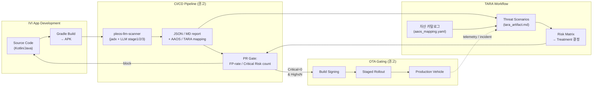

# PleOS 통합 아키텍처 — 본 파이프라인의 CI/CD ↔ OTA ↔ TARA 연계 권고

_작성일: 2026-04-30_

본 문서는 본 정적 분석 파이프라인을 PleOS 차량 SW 개발 라이프사이클에 어떻게
통합할 수 있는지 권고 아키텍처를 제시한다. 본 학기 과제 범위는 정적 분석 PoC까지
이므로 통합은 **권고/설계** 수준이며, 실제 통합 구축은 PleOS 운영팀의 결정 + 별도
구현 단계가 필요.

## 1. 권고 아키텍처 개요 (Mermaid)



## 2. 텍스트 단계 설명 (Mermaid를 못 보는 환경 대비)

```
[1] DEV 단계
    Kotlin/Java 소스 → Gradle build → APK
    (선택) ProGuard/R8 활성화로 식별자 난독화

[2] CI/CD 단계 — pleos-llm-scanner 통합 진입점
    APK가 빌드된 직후, PR 머지 전에 본 파이프라인 자동 실행
    a. scripts/decompile.sh APK → jadx 디컴파일
    b. src/deobf/entropy.py → 난독화 수준 측정
    c. (HIGH 난독화일 때만) configs/prompts/stage0_deobfuscate.md → LLM 이름 복원
    d. configs/keywords.yaml grep → priority class 큐
    e. Stage 1 LLM (configs/prompts/stage1_detect.md) → finding 후보
    f. Stage 2 caller 분석 + (선택) AST 룰 (regex 자동, AST는 Future Work)
    g. Stage 3 멀티 프롬프트 합의 (attacker / defender / domain_expert)
    h. src/aaos_map.py → AAOS / MASVS 매핑
    i. src/tara_generate.py → TARA 시나리오 + Risk Matrix
    출력: data/reports/<apk>_<DATE>.{json,md} + tara_artifact_<DATE>.{json,md}

[3] PR Gate (권고 정책)
    Critical risk count = 0     → 머지 차단 (block)
    High risk count > N         → 리뷰 강제 + Mitigation plan 첨부
    Medium / Low                → comment-only (정보성)
    난독화 수준 HIGH > X%        → 디컴파일 결과 동결 + 별도 분석

[4] TARA 통합 흐름
    Threat Scenarios → Risk Matrix → Treatment 결정
    Treatment 결정이 변경되면 PR Gate 정책의 N 값 자동 갱신
    Telemetry로 들어온 incident → Scenarios에 새 evidence 추가

[5] OTA Gating (권고)
    Gate 통과한 빌드만 서명
    Staged rollout (1% → 10% → 100%)
    각 단계에서 telemetry로 이상 발생 시 자동 rollback
    rollback 트리거 데이터는 다시 TARA Scenarios로 피드백
```

## 3. 본 학기 PoC와 운영 전환의 차이

| 측면 | 본 학기 PoC | 운영 전환 시 |
|---|---|---|
| **분석 엔진** | Claude Code 인터랙티브 세션 | API 통합 (CI/CD trigger) — 단, 환경 제약 (외부 LLM API 미보유)으로 본 학기 권고에 머무름 |
| **트리거** | 사용자 명시 ("X.apk 분석해줘") | PR 이벤트 / nightly batch / OTA pre-flight |
| **결과 저장** | `data/reports/` 로컬 파일 | Artifact server + GitHub Actions output / Slack notification |
| **GT 라벨링** | `self_labels_*.json` 수동 | regression set + 자동 diff (전 커밋 대비 신규/사라진 finding) |
| **TARA 통합** | Static 매핑 표 | 동적 — 신규 finding이 기존 시나리오를 갱신/생성 |
| **OTA 게이팅** | 권고만 | gate policy + 자동 sign reject |
| **재학습** | Claude Code 모델 업데이트 | prompt-as-code + version-pinned Claude model |

## 4. 통합의 가장 작은 단위 (MVP 권고)

만약 PleOS 운영팀이 본 파이프라인을 **최소 비용**으로 활용하려면:

1. **GitHub Actions에 정적 부분만 통합** (외부 LLM 호출 없이):
   - `src/deobf/entropy.py` (Shannon entropy 측정)
   - `configs/keywords.yaml` grep
   - `src/eval.py` + `src/ablation.py`
   - `src/aaos_map.py` + `src/tara_generate.py` (auto-mapping은 결정론적)
   PR마다 entropy/keyword/AAOS 매핑까지는 자동, LLM 분석만 사람이 트리거.

2. **차량 LLM (PleOS-internal)이 활성화되면 Stage 1/2/3 자동화**:
   - PleOS 자체 LLM이 본 파이프라인의 prompts/stage*.md를 그대로 호출
   - 외부 송출 없이 in-vehicle 또는 internal cloud에서 분석 완결
   - 본 학기 환경 제약 (외부 LLM API 없음)이 풀림

3. **후속 학기에 Androidmeda 통합** — Apache 2.0 라이선스로 deobfuscation 모듈만
   import. 본 파이프라인의 entropy 측정 + Androidmeda의 deobf 결과를 cross-check.

## 5. 본 산출물의 데이터 흐름 (실제 measure 기반)

본 학기 산출 데이터를 위 아키텍처에 직접 매핑:

```
GT 라벨 (n=18)
  └─→ src/eval.py            → P/R/F1 측정 (PPT 가설 vs 실측)
  └─→ src/ablation.py        → A/B 변형 (stage 1/2/3, 합의 임계 1/3-2/3-3/3)
  └─→ src/aaos_map.py        → AAOS / MASVS / TARA 매핑 (data/reports/aaos_mapping_table_*.md)
  └─→ src/tara_generate.py   → Threat Scenarios + Risk Matrix (data/reports/tara_artifact_*.md)
  └─→ src/viz/plot_metrics.py → 6개 차트 (data/viz/01~06_*.png)

이 5개 결정론적 모듈이 운영 통합 시 그대로 CI/CD에 plug-in 됨.
LLM stage 1/2/3은 본 학기에는 Claude Code 세션, 운영 시에는 PleOS-internal LLM.
```

## 6. 통합 시 주의사항 (계약과제 IP 보호)

- 본 학기 GitHub repo (`HoyoenKim/pleos-llm-scanner`)는 **scaffold만 공개**.
  `data/apks/`, `data/decompiled/`, `data/reports/` 는 .gitignore.
- 운영 통합 시에도 PleOS APK 소스가 **외부 LLM API에 송출되지 않도록** 차단 필수
  (현재는 환경 제약으로 자연스럽게 만족, 향후 cloud LLM 도입 시 별도 가드).
- TARA 산출물 (자산 카탈로그, 위협 시나리오)은 contract IP — repo public commit
  대상에서 제외, 보고서 v0.9에만 포함.

## 7. Future Work (운영 전환 단계)

- PleOS-internal LLM endpoint 정의되면 `configs/prompts/stage*.md`를 그대로 사용
  가능한 wrapper script (`src/llm_client.py`).
- GitHub Actions workflow yaml — `src/eval.py` + `src/ablation.py`만 자동 실행하고
  결과 차트를 PR comment로 게시.
- TARA 시나리오의 자동 갱신 — 신규 finding이 기존 scenario에 매칭되지 않을 때만
  사람 리뷰로 새 scenario 생성.
- 본 학기 측정 수치를 baseline 으로 운영 후 drift 모니터링.
